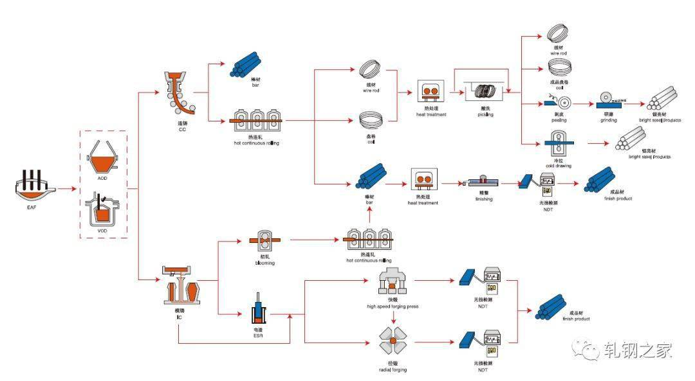
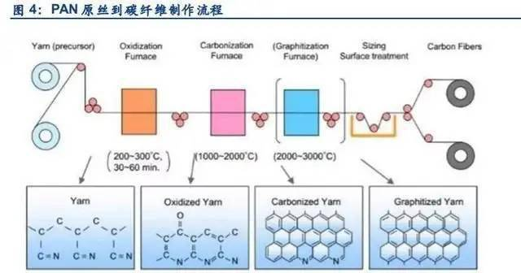
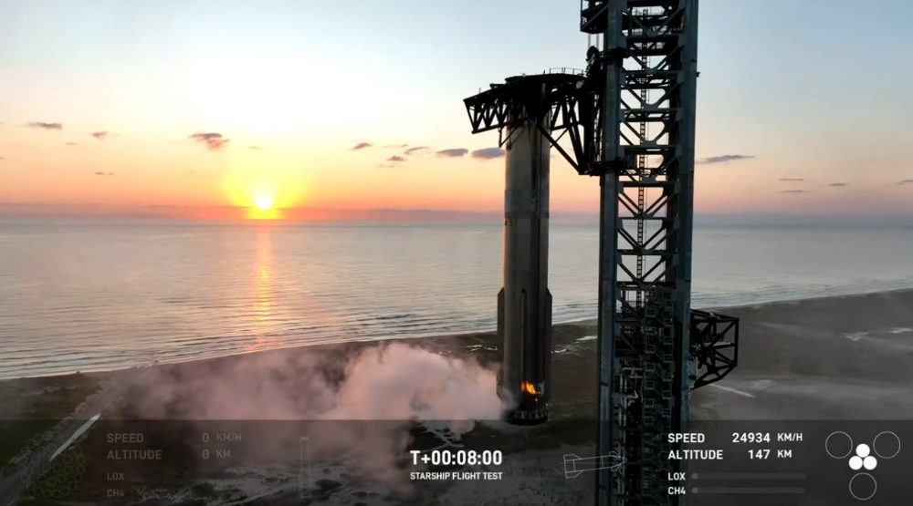
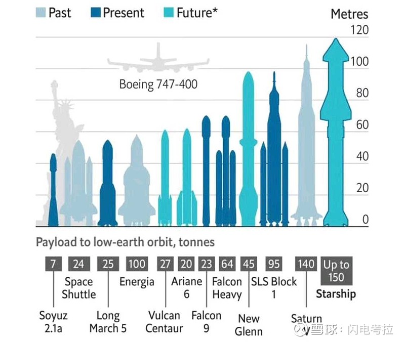

# 专业导论期末论文

**2024级计科1班			钟佳晋		222024321182011**

**主题：3.行业案例研究**			**所选公司：Space X**

## 公司简介

Space X是一家由[Pay Pal](https://baike.baidu.com/item/PayPal/0?fromModule=lemma_inlink)早期投资人[埃隆·马斯克](https://baike.baidu.com/item/埃隆·马斯克/3776526?fromModule=lemma_inlink)于2002年6月建立的太空运输公司。马斯克认为：航天发射成本高昂，在很大程度上是因为庞大的行政机构消耗量大量的成本。因此马斯克决定通过私人企业的方式，以更高效、成本更低廉的方式进行航天太空的探索和运营。其创办理念便是将火箭发射成本降到最低，并实现火箭的重复使用。

在创办之初，由于先前并未有过私人航天企业的先例，加上其多次提出在当时年代看似天马行空的设想，Space X收到许多质疑与诋毁。有人质疑它的资金，有人质疑它的技术，但马斯克从未想过放弃，甚至说到：“不去冒险，就是最大的冒险。”

## 核心技术：星舰(starship)及火箭回收技术

*上述提到，Space X的创办初衷就是降低航天发射成本以及实现火箭的重复使用，星舰及火箭回收技术就是为了以上**实际问题**而生*

### 星舰

[星舰历次发射短片](【一次看个够, 星舰发射短片！“Starship”请带我们前往星辰大海！】https://www.bilibili.com/video/BV1C1421o7ia?vd_source=f46c2a175b53354f0d9e6f55b3fad09a)

#### 星舰与普通火箭的区别

星舰与普通火箭的最大区别就在于星舰的完全可重复使用性，而一般火箭的上级火箭和货物仓是一次性的（尽管普通火箭的助推器部分可以回收，但每次发射都需要制造新的组件，这增加了成本）。此外，星舰不仅能执行地球轨道任务，还可以执行更远的太空探索任务。它能够执行从低地球轨道（LEO）任务到月球和火星探测等深空任务，具有极高的灵活性和适应性。它的设计载荷能力远超目前的普通火箭，能够运载大量货物和乘客，支持大规模的太空运输和定居。而普通火箭通常设计用于特定任务，如将卫星送入轨道、进行科学探测或运送补给到国际空间站，功能相对单一，载荷能力也较为有限。

以上种种，都对星舰的建造材料与工艺提出了更高要求。然而星舰却依然符合Space X奉行的理念——低成本，是如何做到的呢？

#### 星舰制造

##### 材料

2019年，人们还在期待[大猎鹰计划]([马斯克下一个梦想：用“大猎鹰”送人上火星-新华网 (xinhuanet.com)](http://www.xinhuanet.com/world/2018-02/09/c_129809127.htm))是否如期推进的时候，Space X宣布了一件震动整个行业的事：它彻底放弃了大猎鹰火箭的原有设计，直接把碳纤维复合材料改为了不锈钢，项目名称也更换为了starship(星舰)。这看似只是材料的替换，实际上是牵一发而动全身，整个火箭的设计都要重新开始。

星舰采用304 L不锈钢作为主要材料，这种材料具有高强度，耐高温等特点适合多次重复使用。

我们都知道一般的火箭采用的都是Pan碳纤维作为主要材料，除了它的强度大之外，更因为其密度小，利于火箭结构轻量化，降低燃料成本及提高燃料效率。而相比于碳纤维，不锈钢的密集几乎是碳纤维的四倍，这明显不利于成本的降低，那么Space X又为何选用不锈钢替换碳纤维呢？

我们先将不锈钢与碳纤维的各项参数进行比较：

|            性质             |        不锈钢304 L         |         Pan碳纤维          |
| :-------------------------: | :------------------------: | :------------------------: |
|    密度（20℃,g/ cm^3^）     |            7.93            |          1.5-2.0           |
|          熔点（℃）          |         1398~1454          |          1000左右          |
|     热导率（W / m · K）     | （100℃）16.3，（500℃）21.5 | 平行0.72-0.90；垂直：约为9 |
| 比热容（0~100℃,K J /kg· K） |            0.50            |            7.12            |

首先，我们知道星舰的主要目的是降低成本。

不锈钢价格在15元/千克左右，而碳纤维在90元/千克左右。并且，Space X在不锈钢产业方面相对成熟，且材料成本低廉，加工相对简单，制造成本较低；而碳纤维制造则需要更高的技术水平（如需要考虑每层纤维排列方向，来保证材料在每个方向的强度），那么就需要投入更多的成本。

不锈钢制作流程：

碳纤维制作流程：

再者，由于星舰来回穿梭大气层的需要，星舰表面需要增添耐热层。以神州飞船为例，其返回舱回地球是经历的最高温度在1500℃~2000℃之间。对于熔点在1400左右的不锈钢来说，仅需厚度较薄的耐热层即可承受；而对与熔点较低的碳纤维来说，需要的耐热层厚度自然更高。

这样比较下来，不锈钢因重量而增加的成本在以上方面减少的成本则更加微小。

##### 燃料

星舰使用液氧和液体甲烷作为推进剂，这种燃料在地球上储量丰富，价格较低，而且可以在其他天体上通过资源开发获得，降低了深空探测任务的运行成本。

相比于一般火箭使用的偏二甲肼搭配四氧化二氮，液氧搭配液体甲烷不仅制备成本更低，在产生动力上也毫不逊色。加上偏二甲肼作毒性物质，具有较高的毒性处理成本。

##### 猛禽发动机的简化设计

Space X对猛禽发动机进行了简化设计，去掉了初代发动机身上的多数电缆和管路，将多个阀门集成到几个阀门中，并用焊接工艺取代了类似螺丝的紧固件来加强发动机的密封性。这些改进让发动机更难控制，但同时也减轻了重量，提升了推力，并加快了生产的速度。

##### 完全可回收

星舰的制造理念本就与普通火箭不同，它旨在实现多次执行任务。因此，相比于普通火箭的助推器部分可回收，星舰致力于实现完全可回收。即助推器与星舰主体均能回收，且在翻新后能继续投入使用。这一设计极大地降低了连续发射成本。

### 火箭回收技术

#### 最新成果

近期，Space X进行了星舰的第五次发射与回收。其中应用到的“筷子”夹火箭的回收方式令人为之震撼。所谓的“筷子”即是两个机械臂，它们长36米，高18米，通过发射塔底的超大型绞车系统驱动，可沿塔架上的轨道上下移动，同时通过液压油缸的伸缩动作带动机械臂实现打开并合拢。

[火箭回收视频](【Space X 火箭回收剪辑，太科幻了！】https://www.bilibili.com/video/BV13J411s7fo?vd_source=f46c2a175b53354f0d9e6f55b3fad09a)

#### 技术优势

目前，Space X的“猎鹰9号”火箭助推器采用着陆腿回收的技术已经非常成熟，成功率非常高，但缺点在于后续重复利用比较麻烦，需要从着陆场长途转运，无法满足Space X高频次发射的需求。而“筷子夹火箭”虽然技术实现难度大，但火箭回收后可以直接与发射塔对接，后续的检查，加注燃料等步骤可以直接进行，极大减少了发射准备时间。

并且，用机械臂夹住火箭进行回收这一创新之举，可以减少火箭部件在着陆时受到的冲击和损伤，从而延长其使用寿命。

另外，传统的火箭回收方法是在陆地或海洋上利用发动机反推实现软着陆，而火箭部件硬着陆却也可能发生，容易造成环境污染。使用机械臂捕捉则可以减少这样的风险。

## 总结反思

### 失败中前行

失败是星舰项目推进过程中的常态，但也是站在一次次失败的肩膀上，Space X才收获一个又一个的成功。我们常常能看到，Space X发射的火箭在空中或是在回收过程中的爆炸。甚至曾有人调侃马斯克：刚发的两亿奖金，就拿去放了两颗烟花。Space X的试错成本绝不是一般人能想象的，但其在无数次失败之后，仍能坚持自己所走的道路，这便是其能够不断前进的原因。每一次失败，都是为下一次的成功做铺垫。

### 敢创敢闯

第五次星舰发射前，早在7月的网络采访中，马斯克表示Space X的这次飞行目标”听起来有点疯狂“，尽管它”有很大的成功机会“。

> "我们并没有破坏物理学，所以成功是可能的结果之一。"

确实，Space X的每一次创新都可以用疯狂来形容：火箭重复使用、不锈钢造火箭、人类殖民火星......它的每一个设想，在提出时都可以说是当时人们未曾想过或是不敢想的事情。然而Space X总能抵住万般困难，一步步脚踏实地的干下去，不断接近自己的设想。

自创建以来，其火箭发射成本一降再降。火箭发射成本目前一般是2万美元/公斤，猎鹰9号大概能做到5000美元/公斤，而星舰号称要做到1000美元/公斤。

拥有开创未来的勇气，保持不懈追求的毅力，是其成功因素中不可或缺的一项。

